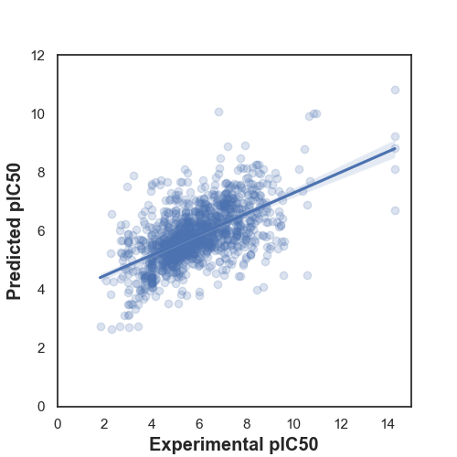

# Predicting Acetylcholinesterase Inhibitors for Alzheimer’s disease using Machine Learning: Drug Discovery application

## Project Overview
Alzheimer’s disease is linked to low levels of acetylcholine, a key neurotransmitter for memory. Acetylcholinesterase (AChE) inhibitors help preserve memory by blocking the enzyme that breaks down acetylcholine. However, existing drugs and traditional wet-lab based methods for drug screening have limitations.
This project leverages machine learning to identify potential AChE inhibitors, enabling faster and more efficient drug discovery. By analyzing bioactivity data and predicting potent compounds, this approach streamlines early-stage screening for Alzheimer’s treatments.

## Objectives
- Identify potential features to classify active versus inactive compound as an AChE inhibitor.
- Discover promising ML predictive models for screening AChE inhibitors

## Main worflow

- **Data Extraction**: Retrieve bioactivity data (e.g. IC50, molecular weight, number of H donors/acceptors,..) related to AChE from the ChEMBL database.
- **Data Preprocessing**: Clean, preprocess, and transform chemical data (in Molar units) to be model-ready (in linear scale).
- **Model Training**: Train Random Forest Regressor model to classify compounds based on their bioactivity (active or inactive) against AChE.
- **Model Evaluation**: Assess different tree-based models' performance using relevant metrics (R-squared, Mean square of Error, Time-taken).

## Dataset

- **Data Source**: ChEMBL database
- **Target Protein**: Acetylcholinesterase (ChEMBL ID: CHEMBL220)
- **Bioactivity Data**: Compounds are classified as active, intermediate, or inactive based on IC50 thresholds, where IC50 < 1,000 nM indicates **strong inhibition (active)**, 1,000–10,000 nM represents moderate inhibition (intermediate), and IC50 ≥ 10,000 nM denotes **weak or no inhibition (inactive)**.

## Findings

### **1) Distinct bioacitvity and physiochemical profiles between active and inactive AChE inhibitors**
- A statiscally significant difference was observed between active and inactive compound based on pIC50 values, confirming a clear separation based on bioactivity (Man-Whitney statistical test)

  

- All **four Lipinski’s descriptors** (Molecular Weight, LogP, HBD, HBA) showed statistically significant differences between active and inactive compounds.  
This indicates distinct **physicochemical property variations** influencing acetylcholinesterase inhibition.
   
<!--Table1-->
<table align="center">
  <tr>
    <th style="text-align:center;">Descriptor</th>
    <th style="text-align:center;">Actives (Mean ± SD)</th>
    <th style="text-align:center;">Inactives (Mean ± SD)</th>
    <th style="text-align:center;">Statistical Significance (if p < 0.05)</th>
  </tr>
  <tr>
    <td style="text-align:center;"><b>pIC50</b></td>
    <td style="text-align:center;">7.30 ± 1.11</td>
    <td style="text-align:center;">4.23 ± 0.66</td>
    <td style="text-align:center;">p = 7.53e-74</td>
  </tr>
  <tr>
    <td style="text-align:center;"><b>Molecular Weight</b></td>
    <td style="text-align:center;">433.35 ± 120.86</td>
    <td style="text-align:center;">372.02 ± 116.23</td>
    <td style="text-align:center;">p < 1e-10</td>
  </tr>
  <tr>
    <td style="text-align:center;"><b>LogP</b></td>
    <td style="text-align:center;">4.91 ± 1.97</td>
    <td style="text-align:center;">3.76 ± 1.88</td>
    <td style="text-align:center;">p = 7.23e-91</td>
  </tr>
  <tr>
    <td style="text-align:center;"><b>NumHDonors</b></td>
    <td style="text-align:center;">1.26 ± 1.15</td>
    <td style="text-align:center;">1.01 ± 1.13</td>
    <td style="text-align:center;">p = 4.96e-15</td>
  </tr>
  <tr>
    <td style="text-align:center;"><b>NumHAcceptors</b></td>
    <td style="text-align:center;">4.63 ± 1.95</td>
    <td style="text-align:center;">4.34 ± 1.95</td>
    <td style="text-align:center;">p = 3e-6</td>
  </tr>
</table>

### **2)  Tree-based models show potential predictive power**
- Decision Tree regressor, Extra Tree Regressor, and Random Forest regressor achiveve an R-square of 0.77 to 0.82 with RMSE arround 0.65.
- The Predicted vs. Actual pIC50 (using Random Forest model) plot shows a moderate correlation (general upward trend), with large spread of points indicating that while the model captures general trends, it struggles with precise predictions, likely due to data noise or feature limitations.

  

