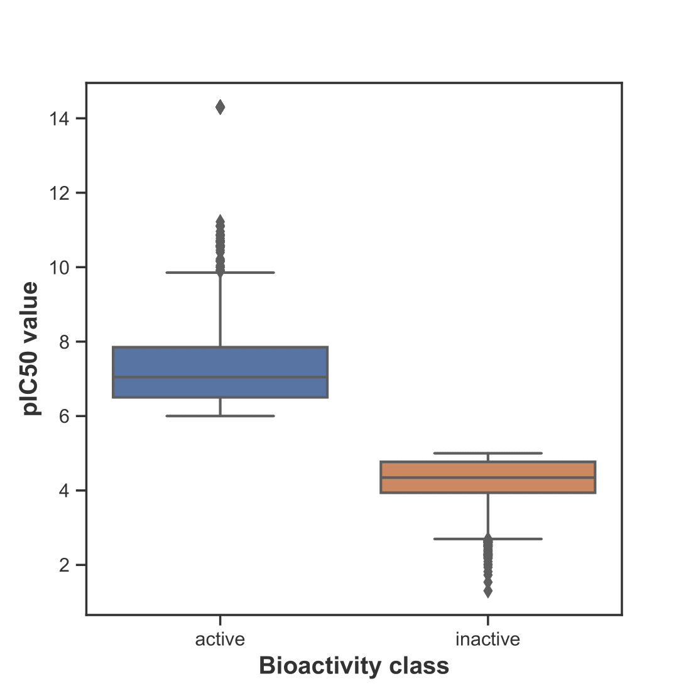

# Computational Drug Discovery for Acetylcholinesterase Inhibitors

## Project Overview
People with Alzheimer’s have lower levels of acetylcholine, a neurotransmitter crucial for memory. The enzyme Acetylcholinesterase (AChE) breaks down acetylcholine, so AChE inhibitors are used to block this action, helping to preserve memory function. Current drugs have limits, so this project uses machine learning to identify new, effective inhibitors that could better support patients with Alzheimer’s and similar diseases. Indentifying potential AChE inhibitors through computational models provides an efficient way to screen compounds and accelerate drug discovery.

## Objectives

- **Data Extraction**: Retrieve bioactivity data related to AChE from the ChEMBL database.
- **Data Preprocessing**: Clean, preprocess, and transform chemical data to be model-ready.
- **Model Training**: Train a machine learning model to classify compounds based on their bioactivity (active or inactive) against AChE.
- **Model Evaluation**: Assess model performance using relevant metrics.
- **Result Interpretation**: Identify potential lead compounds for further experimental validation.

## Dataset

- **Data Source**: ChEMBL database
- **Target Protein**: Acetylcholinesterase (ChEMBL ID: CHEMBL220)
- **Bioactivity Data**: Compounds with bioactivity data classified as active, inactive, or intermediate.

## Findings

### **1) Distinct bioacitvity and physiochemical profiles of AChE inhibitors**
#### - A statiscally significant difference was observed between active and inactive compound based on pIC50 values, confirming a clear separation based on bioactivity (Man-Whitney statistical test)

  

#### - All **four Lipinski’s descriptors** (Molecular Weight, LogP, HBD, HBA) showed statistically significant differences between active and inactive compounds.  
This indicates distinct **physicochemical property variations** influencing acetylcholinesterase inhibition.
   
<!--Table1-->
<table align="center">
  <tr>
    <th style="text-align:center;">Descriptor</th>
    <th style="text-align:center;">Actives (Mean ± SD)</th>
    <th style="text-align:center;">Inactives (Mean ± SD)</th>
    <th style="text-align:center;">Statistical Significance</th>
  </tr>
  <tr>
    <td style="text-align:center;"><b>pIC50</b></td>
    <td style="text-align:center;">7.30 ± 1.11</td>
    <td style="text-align:center;">4.23 ± 0.66</td>
    <td style="text-align:center;">p = 7.53e-74</td>
  </tr>
  <tr>
    <td style="text-align:center;"><b>Molecular Weight</b></td>
    <td style="text-align:center;">433.35 ± 120.86</td>
    <td style="text-align:center;">372.02 ± 116.23</td>
    <td style="text-align:center;">p < 1e-10</td>
  </tr>
  <tr>
    <td style="text-align:center;"><b>LogP</b></td>
    <td style="text-align:center;">4.91 ± 1.97</td>
    <td style="text-align:center;">3.76 ± 1.88</td>
    <td style="text-align:center;">p = 7.23e-91</td>
  </tr>
  <tr>
    <td style="text-align:center;"><b>NumHDonors</b></td>
    <td style="text-align:center;">1.26 ± 1.15</td>
    <td style="text-align:center;">1.01 ± 1.13</td>
    <td style="text-align:center;">p 4.96e-15</td>
  </tr>
  <tr>
    <td style="text-align:center;"><b>NumHAcceptors</b></td>
    <td style="text-align:center;">4.63 ± 1.95</td>
    <td style="text-align:center;">4.34 ± 1.95</td>
    <td style="text-align:center;">p = 3e-6< 0.05</td>
  </tr>
</table>
